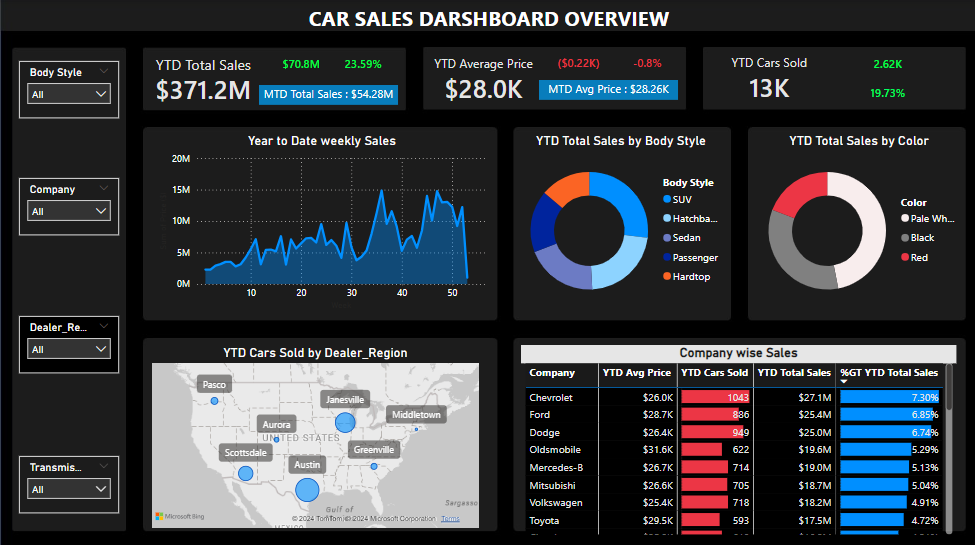

# Car Sales Dashboard

This is an interactive **Car Sales Dashboard** designed to visualize year-to-date (YTD) car sales data across different metrics such as body style, dealer region, company, and car color. The dashboard provides a clear overview of the key metrics and insights that help understand car sales trends.

## Dashboard Overview



### Key Metrics Displayed:

- **YTD Total Sales**: Displays total sales in monetary value year to date.
- **YTD Average Price**: The average price of cars sold this year to date.
- **YTD Cars Sold**: The total number of cars sold YTD.
- **MTD (Month-to-Date) Metrics**: Includes MTD total sales and average price.
- **Sales by Body Style**: Pie chart depicting the percentage of cars sold categorized by body styles such as SUV, Sedan, Hardtop, etc.
- **Sales by Color**: Pie chart visualizing cars sold by colors such as Black, Red, and White.
- **Year to Date Weekly Sales**: A line chart representing the trend in weekly car sales throughout the year.
- **YTD Cars Sold by Dealer Region**: A geographical map showing the number of cars sold in various dealer regions.
- **Company-wise Sales**: A bar chart that highlights the number of cars sold and the total sales amount for each company.

---

## Technologies Used

- **Power BI**: The dashboard was created using Power BI, taking advantage of its data visualization capabilities for presenting the car sales data.
- **Calendar Functions**: Calendar functions were used to calculate YTD (Year-To-Date) and MTD (Month-To-Date) data.
- **Data Slicing & Filtering**: The dashboard includes interactive slicers for filtering the data by:
  - Body Style
  - Company
  - Dealer Region
  - Transmission Type

---

## Visualization Charts

- **Line Chart**: Shows year-to-date weekly car sales, providing insights into sales trends across the year.
- **Pie Charts**: Break down sales by body style and color.
- **Map Visualization**: A geographical map visualizes the number of cars sold across various regions in the United States.
- **Bar Chart**: Displays company-wise sales performance, including the percentage of the total sales each company contributed.

---

## How to Use

1. **Install Power BI Desktop** (if you haven't already) to open and modify the dashboard file.

2. **Clone the repository using the following command**:

   ```bash
   git clone https://github.com/your-username/car-sales-dashboard.git 
   ```

3. **Explore the Dashboard:** Use the slicers and interactive charts to filter data based on your analysis needs.

